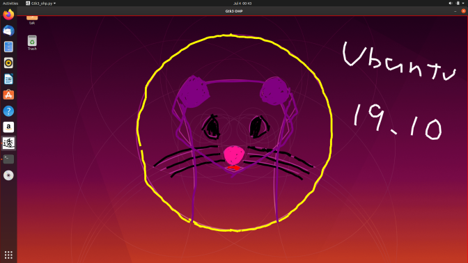

 pysukeban (a.k.a. pygtk_ohp_app) [](https://travis-ci.org/mamewotoko/pygtk_ohp_app) [](https://github.com/mamewotoko/pygtk_ohp_app/actions)
=========================

[日本語](README_ja.md)

Demo
-------

[](http://www.youtube.com/watch?v=iN-biqblD2g "stay at home")


  


Platforms
---------

pysukeban Runs on following environmnent.

* [Homebrew](https://brew.sh/index_ja) installed Mac
* Ubuntu (Linux)
  * [Ubuntu 18.04](https://www.ubuntulinux.jp/News/ubuntu1804)
  * [Ubuntu 19.10](https://www.ubuntulinux.jp/News/ubuntu1910)
  * [Ubuntu 20.04](https://releases.ubuntu.com/20.04/)
* [CentOS7](https://wiki.centos.org/Download)
* [MSYS2](https://www.msys2.org/) installed Window10 PC
* [Raspbian Gnu/Linux 9 (Stretch)](http://downloads.raspberrypi.org/raspbian/images/)
* [Raspbian Gnu/Linux 10 (Buster)](http://downloads.raspberrypi.org/raspbian/images/)

## How to use
### Setup
1. To install required libraries, open terminal and execute following command line.

    ```bash
    sh setup.sh
    ```

### If you run on raspberry pi

1. add X11 configuration. add following lines to `/etc/X11/vncserver-virtual.conf` file.

    ```
    Section "Extensions"
      Option "Composite" "Enable"
    EndSection
    ```

2. restart raspberry pi.

    ```bash
    sudo reboot
    ```

3. Run following command on raspberry pi to support transparent window.

    ```bash
    xcompmgr -c &
    ```

### Run

1. Run

    ```bash
    ./bin/gtk3_ohp.py
    ```

A transparent window with red frame will be displayed. You can draw figure with your mouse or pen.

### Operations

#### Key bindings

* Basics

Operation|Key
---------------|----------
Undo|Ctrl-z, Command-z
Redo|Ctrl-y, Command-y
Paste image|Ctrl-v,  Command-v
Delete all|Ctrl-d, Command-d
Minimize, maximize window|Ctrl-f or Command-f

* Page operations

Operation|Key
---------------|----------
Next page|Ctrl-n<br>Command-n<br>Ctrl-tab<br>Command-tab
Previous page|Ctrl-p<br>Command-p<br>Ctrl-Shift-tab<br>Command-Shift-tab
Insert a page after|Ctrl-Shift-n<br>Command-Shift-n<br>Ctrl-t<br> Command-t
Insert a page before|Ctrl-Shift-p<br>Command-Shift-p
Move to Nth page|Ctrl-{0-9}, Command-{0-9}

* change current text, line color

Color|Key
---------------|----------
Red|Shift-r
Navy|Shift-n
Green|Shift-g
Pink|Shift-p
Black|Shift-b
White|Shift-w
Yellow|Shift-y
Purple(Murasaki in Japanese)|Shift-m
Orange|Shift-o
Aqua|Shift-a

width of line and font size : 1 - 9 key

#### Command line options

* `--foreground-color` pen, text color (comma separated three values between 0 and 1.0. default `0,1,0`)
* `--background-color` background color (comma separated three values between 0 and 1.0. default `1,1,1`)
* `--opaque` use opaque background color. (default transparent)
* `--line-width` width of pen (default `5`)
* `--font` font name

## References

* [Bookmarklet version](https://mamewo.ddo.jp/bookmarklet_ohp.html)
  * Draw on Web pages

## Licenes

```
   Copyright (C) 2020-2021 Takashi Masuyama

   Licensed under the Apache License, Version 2.0 (the "License");
   you may not use this file except in compliance with the License.
   You may obtain a copy of the License at

       http://www.apache.org/licenses/LICENSE-2.0

   Unless required by applicable law or agreed to in writing, software
   distributed under the License is distributed on an "AS IS" BASIS,
   WITHOUT WARRANTIES OR CONDITIONS OF ANY KIND, either express or implied.
   See the License for the specific language governing permissions and
   limitations under the License.
```

----
Takashi Masuyama < mamewotoko@gmail.com >
https://mamewo.ddo.jp/
