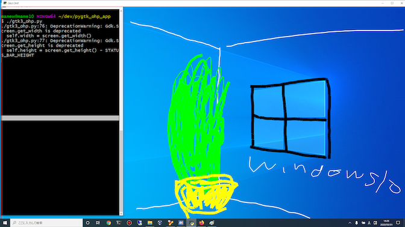
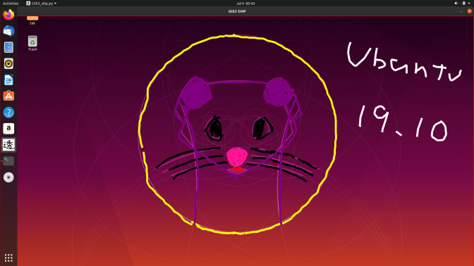

 GTK3でOHPシートのようなアプリ [](https://travis-ci.org/mamewotoko/pygtk_ohp_app) [](https://github.com/mamewotoko/pygtk_ohp_app/actions)
=========================

## デモ

[](http://www.youtube.com/watch?v=iN-biqblD2g "家にいよう")

Macの写真アプリの上にアプリを起動して文字を書いてみました。



  


## 前提
以下のいずれかを準備してください

* [Homebrew](https://brew.sh/index_ja) がインストールされたMac
* Ubuntu (Linux)
  * [Ubuntu 18.04](https://www.ubuntulinux.jp/News/ubuntu1804)
  * [Ubuntu 19.10](https://www.ubuntulinux.jp/News/ubuntu1910)
  * [Ubuntu 20.04](https://releases.ubuntu.com/20.04/)
* [CentOS7](https://wiki.centos.org/Download)
* [MSYS2](https://www.msys2.org/) がインストールされたWindows 10
* [Raspbian Gnu/Linux 9 (Stretch)](http://downloads.raspberrypi.org/raspbian/images/)
* [Raspbian Gnu/Linux 10 (Buster)](http://downloads.raspberrypi.org/raspbian/images/)

## 使い方
### 準備
1. ターミナルを開いて、以下のコマンドを実行し、gtk+3などをインストールします。

    ```
    sh setup.sh
    ```

### 追加の準備(raspberry piで実行する場合)

1. X11の設定ファイル `/etc/X11/vncserver-virtual.conf` に以下の設定を追加します。

    ```
    Section "Extensions"
      Option "Composite" "Enable"
    EndSection
    ```

2. raspberry piを再起動します。

    ```
    sudo reboot
    ```

3. 透明なウィンドウをサポートするためコマンドを実行します。

    ```
    xcompmgr -c &
    ```

### 起動

1. 起動

    ```
    ./bin/gtk3_ohp.py
    ```

赤枠の入った透明なWindowが画面いっぱいに出ます。この上にマウスドラッグで絵が描けます。

### 操作方法

#### キーバインド

* 基本

操作|キー
---------------|----------
元に戻す(undo)|Ctrl-z または Command-z
元に戻した操作のやり直し(redo)|Ctrl-y または Command-y
コピーした画像、テキストの貼り付け|Ctrl-v または Command-v
全削除|Ctrl-d または Command-d
高さを縮める、広げる|Ctrl-f または Command-f

* ページ操作

操作|キー
---------------|----------
次のページを表示|Ctrl-n または　Command-n または Ctrl-tab または Command-tab
前のページを表示|Ctrl-p または　Command-p または Ctrl-Shift-tab または Command-Shift-tab
ひとつ後にページを追加|Ctrl-Shift-n または　Command-Shift-n または Ctrl-t または Command-t
ひとつ前にページを追加|Ctrl-Shift-p または　Command-Shift-p
nページ目に移動|Ctrl-{数字キー} または　Command-{数字キー}

* テキスト、線の色変更

操作|キー
---------------|----------
レッド|Shift-r
ネイビー|Shift-n
グリーン|Shift-g
ピンク|Shift-p
ブラック|Shift-b
ホワイト|Shift-w
イエロー|Shift-y
むらさき|Shift-m
オレンジ|Shift-o
アクア|Shift-a

1 - 9キーで線の太さ、文字の大きさを変更

#### 起動時のコマンドラインオプション

* `--foreground-color` ペン、文字の色。 (0 - 1.0の値の三つ組。カンマ区切り。デフォルト `0,1,0` )
* `--background-color` 背景色。 (0 - 1.0の値の三つ組。カンマ区切り。デフォルト `1,1,1` )
* `--opaque` 背景色を塗る。指定しない場合は透明にする。
* `--line-width` ペンの太さ。 (デフォルト `5`)
* `--font` フォント名。

## Q&A
### 用途は?

* 資料を表示して、その上に手書きで線を引いたり、字を描きたい場合にお使いください。
* 何かを下書きにして、落書きしたい時とかにもお使いください。

### このアプリを起動中に後ろにあるアプリを操作したいのですが

いったん最小化するかCtrl-Fを押して小さくしてなどして、マウス、キー操作をしてください。

### なぜ GTK なんですか?

ふと、やってみたくなったので。

### 日本語の文字列を貼り付ける(Ctrl-v)とトウフ □ (placeholder glyph) が出るんですが

`--font` オプションで日本語フォント名を設定してください。

## TODO

* 実行時に出る警告をなくす

    ```
    ./gtk3_ohp.py:55: DeprecationWarning: Gdk.Screen.get_width is deprecated
    self.width = screen.get_width()
    ./gtk3_ohp.py:56: DeprecationWarning: Gdk.Screen.get_height is deprecated
    self.height = screen.get_height() - STATUS_BAR_HEIGHT
    ```

* UIの反応などの改善
  * 線をマウスで書いていると、カクカクする
  * 描画が重いような気がする

* websocketでの共有機能

## 参考

* [Bookmarklet版](https://mamewo.ddo.jp/bookmarklet_ohp.html)
  * Web ページに落書きする

## ライセンス

```
   Copyright (C) 2020 Takashi Masuyama

   Licensed under the Apache License, Version 2.0 (the "License");
   you may not use this file except in compliance with the License.
   You may obtain a copy of the License at

       http://www.apache.org/licenses/LICENSE-2.0

   Unless required by applicable law or agreed to in writing, software
   distributed under the License is distributed on an "AS IS" BASIS,
   WITHOUT WARRANTIES OR CONDITIONS OF ANY KIND, either express or implied.
   See the License for the specific language governing permissions and
   limitations under the License.
```

付録: pythonでのパッケージング方法
===============================
* <https://packaging.python.org/tutorials/packaging-projects/>

----
Takashi Masuyama < mamewotoko@gmail.com >
https://mamewo.ddo.jp/
